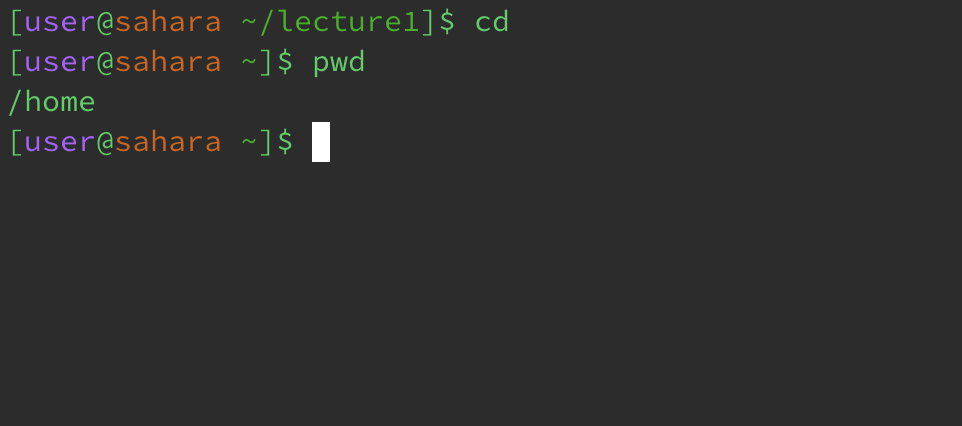
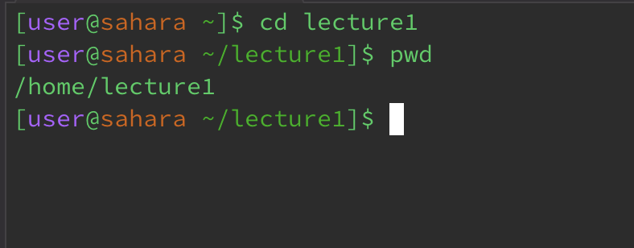
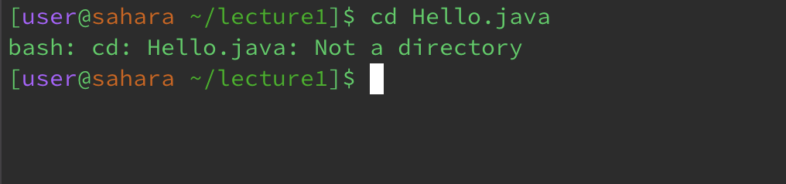
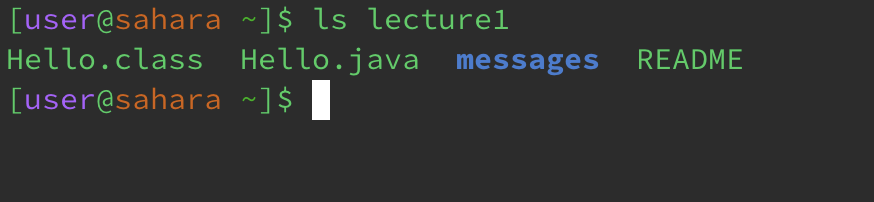
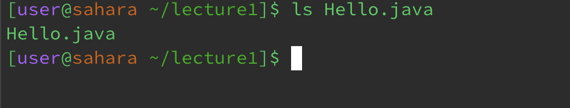
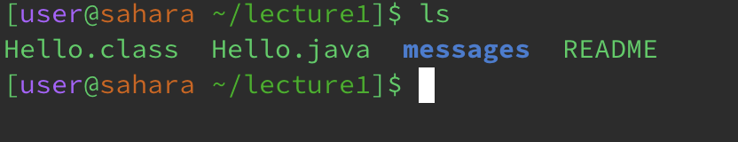
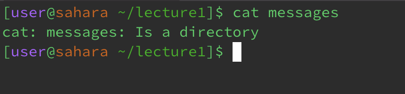
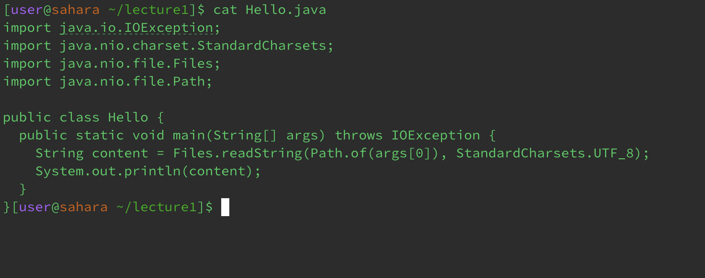
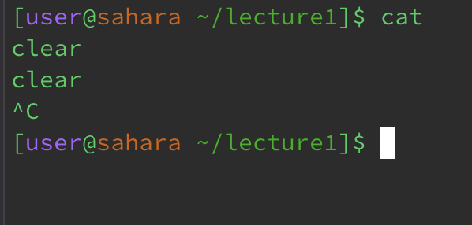

# Lab Report 1 - CSE 15L

---

## cd
---

Working directory is /home/lecture1/ and is being changed into /home \
When cd is used without an argument, the working directory is changed to /home.

---

Working directory is /home and is being changed into /home/lecture1/ \
When cd is usd with a folder as an argument, the working directory is changed to that folder.

---

Working directory is /home/lecture1/ \
When cd is used with a file as an argument, an error message is displayed.

---

## ls

Working directory is /home \
When ls is used with a folder as an argument, the contents of the folder are displayed.

---

Working directory is /home/lecture1/ \
When ls is used with a file as an argument, the path of the file is displayed, as input in the argument.

---

Working directory is /home/lecture1/ \
When ls is used without any arguments, the contents of the working directory are displayed.

---

## cat
---

Working directory is /home/lecture1/ \
When cat is used with a folder as an argument, an error message is displayed, identifying it as a directory.

---

Working directory is /home/lecture1/ \
When cat is used with a file as an argument, the contents of the file are displayed.

---

Working directory is /home/lecture1/ \
When cat is used with no argument, there is no initial response but the command is waiting for an input which it then prints out, this will continue indefinitely. it can be exited using ^C
